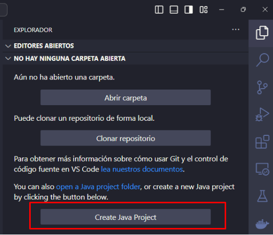
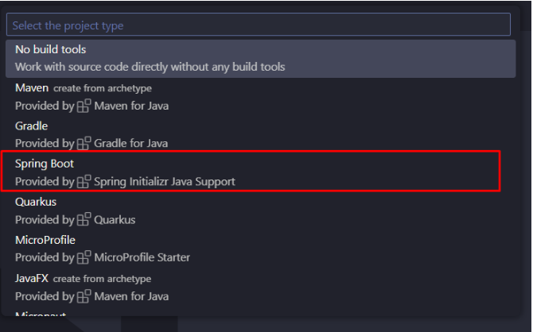
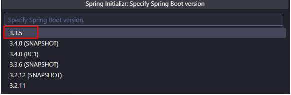
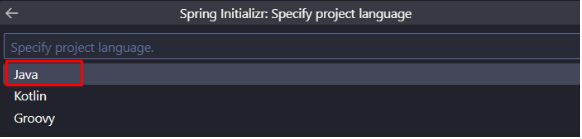
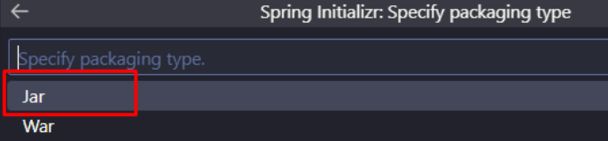
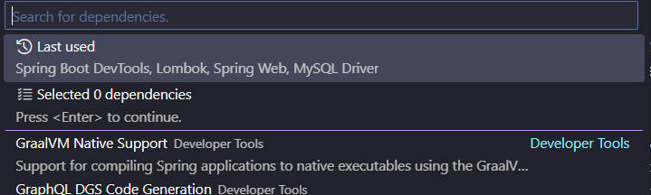

# Crear el Proyecto Spring Boot con Visual Studio Code

Hay Alternativas a VSCode que pueden ser más cómodas de trabajar con Spring Boot (IntelliJ, Spring Tool Suite, entre otros). Sin embargo, vamos a trabajar con VSCode
debido a la familiaridad que algunos de ustedes tienen con la herramienta.

En VSCode recomiendo instalar las siguientes extensiones:

- Extension Pack for Java
- Language Support for Java(TM) by Red Hat
- Spring Boot Extension Pack
- spring Boot Gradle Plus (Para instalar dependencias al proyecto con Gradle)

## Pasos para crear el proyecto en VSCode

1. En ícono del explorador, dar clic en el botón _Create Java Project_
   
2. **Select project type**: Luego, sale una desde el buscador, el tipo de proyecto. En este punto se selecciona Spring Boot.
   
3. **Select (Spring boot) Project Type**: Se escoge el tipo de proyecto Spring Boot. Acá seleccionaremos _Gradle Project_
    Project Type.")
4. **Specify Spring boot project version**: Luego, escogemos la versión del proyecto. Utilizaremos la que esté selecciona por defecto.
   
5. **Select proyect language**: En este punto se escoge el lenguaje. Seleccionamos _Java_
   
6. **Input group id**: Luego, seleccionamos el Identificador del grupo (_Group id_) del proyecto. Para nuestro proyecto, escribiremos "com.ejemplo"
   
7. **Input artefact id**: Ahora, escribiremos el Identificador del artectacto (_Artefact Id_), es decir nuestra aplicación. Acá escribimos: _rentacar_
   
8. **Specify packaging type**: Luego, seleccionamos el tipo de empaquetamiento del proyecto. Selecionaremos _Jar_
   
9. **Specify Java version**: En este punto seleccionamos la versión de Java. Lo correcto es escoger la que tenemos instalada en nuestro equipo. **Es necesario tener instalada una versión de java igual o superior a la 17** Si nuestra versión no coincide con la que nos muestra el asistente, la cambiamos luego en el archivo _build.gradle_:

   ```gradle
   java {
    toolchain {
        languageVersion = JavaLanguageVersion.of(23)
    }
   }
   ```

10. **Choose dependencies** Acá selecionamos las dependencias que utilizaremos en el proyecto. en el cuadro _Search dependencies_ las buscamos y presionamos Espacio para seleccionarla. Finalmente, presionamos Enter para continuar.
    

Si no hay errores, se nos presenta una ventana que indica que se creó exitosamente el proyecto y que si deseamos abrir la carpeta del proyecto. Acá damos clic en el botón _Open_

## Organizar el proyecto

Vamos a tratar de organizar el proyecto con la configuración recomendada. Para eso, le damos clic derecho en el nombre del último paquete dentro de la ruta
src/main/java/com/example/rentacar y le damos clic a la opción _New Java Package_ le damos un nombre al paquete y luego presionamos _Enter_ para que lo cree.

Los paquetes a crear inicialmente son entity, controller, service, repository

Se puede (y se debe) separar más las responsabilidades dentro del proyecto, agregando paquetes como dtos, model, etc. Por el momento lo dejaremos con los paquetes iniciales.

### Creando las entidades JPA

Con base en los objetos de base de datos mostrados en el capítulo anterior, vamos a generar las Entidades de JPA y los repositorios para poder gestionar estas entidades.

1. Damos clic derecho en la carpeta de entidades (_entity_), luego clic en _New Java File_ y luego clic en _Class_
2. Le damos el nombre de la clase y presionamos _Enter_, por ejemplo, la entidad Cliente.
   Este es el código de la clase Cliente basado en nuestra base de datos:

```java

package com.example.rentacar.entity;

import java.util.List;

import jakarta.persistence.Entity;
import jakarta.persistence.GeneratedValue;
import jakarta.persistence.GenerationType;
import jakarta.persistence.Id;
import jakarta.persistence.OneToMany;
import lombok.Data;

@Entity
@Data
public class Cliente {

    @Id
    @GeneratedValue(strategy = GenerationType.IDENTITY)
    private Integer idCliente;
    private String nombre;
    private String direccion;
    private String telefono;
    private String email;

    @OneToMany(mappedBy = "idReserva")
    private List<Reserva> reservas;

}


```

En JPA, las clases son anotadas para que puedan representar los elementos de la base de datos. Por ejemplo, la anotación @Entity determina que una clase va a representar una tabla en la base de datos. la anotación @Id representa en en el atributo de la clase, la columna identidad de la tabla.
Otras anotaciones útiles pueden ser consultadas en el siguiente enlace:
[Manual avanzado de JPA](http://static1.1.sqspcdn.com/static/f/923743/15024995/1320737616283/Manualjpa.pdf?token=WliVrqXbYW75JEEdISncmQN6TNM=)

El resto de entidades se puede ver en el repositorio de ejemplo de esta guia.

### Creando los repositorios

Los repositorios JPA nos permiten manejar los datos de las entidades. Hay varios tipos de entidades en JPA que tienen definidos métodos que podemos utilizar para buscar, guardar, actualizar y eliminar datos de las entidades. Una de esas interfaces es CrudRepository, que vamos a utilizar para manejar las entidades que creamos anteriormente. Lo

Ejemplo de repositorio de Cliente:

```java

package com.example.rentacar.repository;

import org.springframework.data.repository.CrudRepository;

import com.example.rentacar.entity.Cliente;

public interface ClienteRepositorio extends CrudRepository<Cliente, Integer> {

}


```

Al extender la interfaz _CrudRepository_ se tienen disponibles métodos como los siguientes:

- save: guarda una entidad
- saveAll: guarda las entidades de una lista iterable
- findById: busca por el identificador
- existsById: verifica si existe un identificador
- findAll: devuelve todos los elementos para la entidad
- findAllById: busca todos los elementos que tengan el identificador
- count: devuelve el total de registros de la entidad
- deleteById: elimina un registro para el identificador
- delete: elimina la entidad
- deleteAllById: elimina todos los elementos que correspondan con el id
- deleteAll(Iterable): elimina todos los elementos que se reciban en el parámetro
- deleteAll(): elimina todos los elementos

Más información sobre los repositorios de JPA se puede encontrar en el siguiente enlace:
[JPA Repositories](https://docs.spring.io/spring-data/jpa/docs/1.5.0.RELEASE/reference/html/repositories.html)

### Creando los servicios

Los servicios los utilizamos para separar las responsabilidades por unidades dentro de la aplicación.
La idea es que los servicios sean los que implementen a los repositorios y los datos, y que los controladores llamen únicamente a los servicios. También es buena práctica agregar un objeto DTO basado en las entidades para que sea utilizado por los controladores y no usen directamente éstas. En este proyecto por aspectos de simplicidad, de momento vamos a ignorar esta práctica. La práctica que si realizarmos en este guía es hacer una abstracción de los servicios, es decir, realizaremos interfaces para acceder a los servicios. Esto tiene algunas ventajas como modularización, seguridad, entre otros.

Un ejemplo de servicio para cliente sería realizar la interfaz IClienteServicio que tendrá las definiciones de los servicios y habrá una clase que implementará la interfaz:

```java
package com.example.rentacar.service;

import java.util.List;

import com.example.rentacar.entity.Cliente;

public interface IClienteServicio {

    Cliente crearCliente(Cliente datosCliente) throws Exception;

    Cliente obtenerClientePorId(Integer id) throws Exception;

    List<Cliente> obtenerClientes() throws Exception;
}

```

También se tiene el código de la clase que implementa la interfaz:

```java

package com.example.rentacar.service.impl;

import org.springframework.beans.factory.annotation.Autowired;
import org.springframework.stereotype.Service;

import com.example.rentacar.entity.Cliente;
import com.example.rentacar.repository.ClienteRepositorio;
import com.example.rentacar.service.IClienteServicio;

@Service
public class ClienteServicioImpl implements IClienteServicio {

    @Autowired
    private ClienteRepositorio repo;

    @Override
    public Cliente crearCliente(Cliente datosCliente) throws Exception {
        return repo.save(datosCliente);
    }

    @Override
    public Cliente obtenerClientePorId(Integer id) throws Exception {
        return repo.findById(id).orElseThrow(() -> new Exception("Cliente no encontrado"));
    }

    @Override
    public Iterable<Cliente> obtenerClientes() throws Exception {
        return repo.findAll();
    }

}

```
