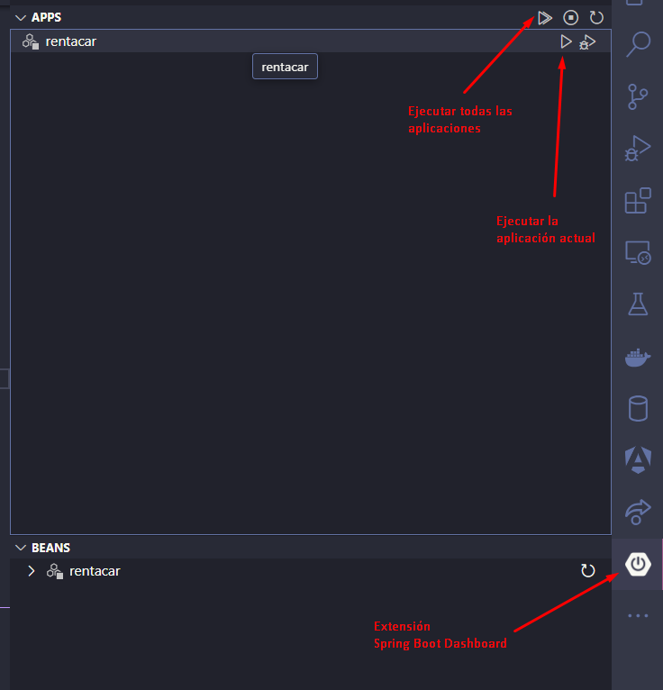
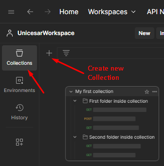
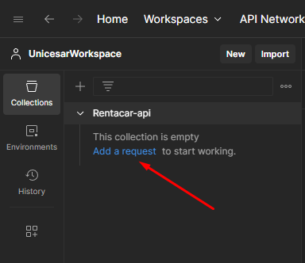
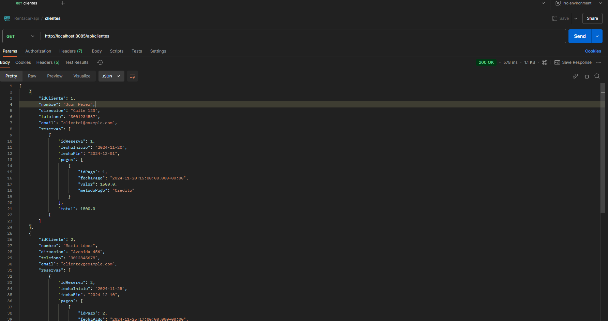
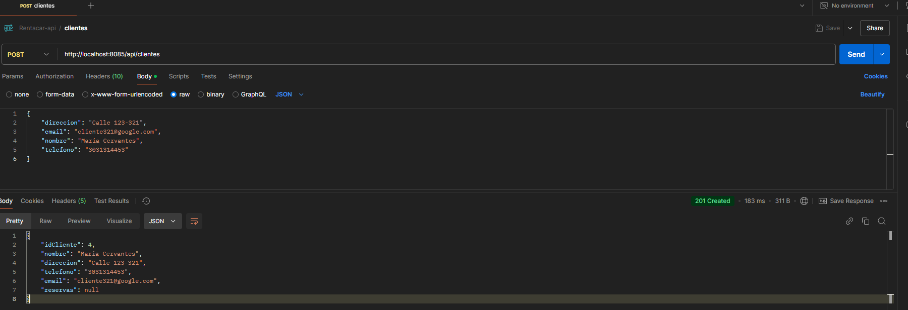
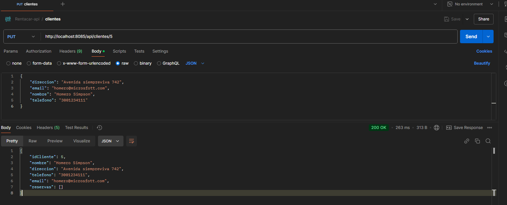

# Desarrollo del Backend API (I)

## Creando los controladores

En esta parte creamos los controladores que utilizaran los servicios. Los controladores son
etiquetados con @RestController, que indica que la clase manejará peticiones de tipo REST.

Este es un ejemplo del controlador de cliente:

```java

package com.example.rentacar.controller;

import org.springframework.web.bind.annotation.RequestMapping;
import org.springframework.web.bind.annotation.RestController;

import com.example.rentacar.entity.Cliente;
import com.example.rentacar.service.IClienteServicio;

import java.util.Optional;

import org.springframework.beans.factory.annotation.Autowired;
import org.springframework.http.HttpStatus;
import org.springframework.http.ResponseEntity;
import org.springframework.web.bind.annotation.GetMapping;
import org.springframework.web.bind.annotation.PathVariable;
import org.springframework.web.bind.annotation.PostMapping;
import org.springframework.web.bind.annotation.RequestBody;
import org.springframework.web.bind.annotation.PutMapping;

@RestController
@RequestMapping("/api/clientes")
public class ClienteControlador {

    @Autowired
    private IClienteServicio clienteServicio;

    @GetMapping("/{id}")
    public ResponseEntity<Cliente> getClientePorId(@PathVariable Integer id) {
        Optional<Cliente> opCliente = clienteServicio.obtenerClientePorId(id);

        if (opCliente.isPresent()) {
            return ResponseEntity.ok().body(opCliente.get());
        }

        return ResponseEntity.notFound().build();

    }

    @PostMapping
    public ResponseEntity<Cliente> crearCliente(@RequestBody Cliente entity) {
        Cliente nuevoCliente = clienteServicio.crearCliente(entity);

        return ResponseEntity.status(HttpStatus.CREATED).body(nuevoCliente);
    }

    @PutMapping("/{id}")
    public ResponseEntity<Cliente> actualizarCliente(@PathVariable Integer id, @RequestBody Cliente clienteOld) {
        Optional<Cliente> cliente = clienteServicio.obtenerClientePorId(id);
        if (cliente.isPresent()) {
            Cliente clienteNew = cliente.get();
            clienteNew.setDireccion(clienteOld.getDireccion());
            clienteNew.setEmail(clienteOld.getEmail());
            clienteNew.setNombre(clienteOld.getNombre());
            clienteNew.setTelefono(clienteOld.getTelefono());
            return ResponseEntity.ok(clienteServicio.crearCliente(clienteNew));
        }
        return ResponseEntity.notFound().build();
    }

}


```

## Configurar la conexión a la base de datos

Para conectarnos a la base de datos desde el backend, agregamos los siguientes datos al archivo de configuración de la aplicación, _application.properties_:

```properties

#URL de conexión a la base de datos
spring.datasource.url=jdbc:mysql://localhost:3307/rentacardb
#Tipo de controlador de la BD
spring.datasource.driverClassName=com.mysql.cj.jdbc.Driver
spring.jpa.properties.hibernate.dialect=org.hibernate.dialect.MySQLDialect
#Muestra en consola las consultas sql generadas
spring.jpa.show-sql=true
spring.datasource.username=root
spring.datasource.password=root

```

## Ejecutando la aplicación

Para ejecutar la aplicación tenemos varias opciones, la primera es ejecutar el _wrapper de gradle_, en la terminal, con el siguiente comando:

```bat

gradlew.bat bootRun


```

La otra opción es usar la extension _Spring Boot Dashboard_ desde el ícono _Run_ de la aplicación, como se ve en la imagen:



## Probando el Backend con Postman

[Postman](https://www.postman.com/), es una popular herramienta para desarrollo, pruebas y documentación de todo tipo de APIs, especialmente REST. Permite hacer todo el proceso de pruebas, incluso de automatización de estas, para ahorrar tiempo y tener una mejor cobertura.

Acá vemos algunos enlaces para conocer y manejar muy bien esta herramienta:

- Tutorial definitivo de Postman: <https://www.youtube.com/watch?v=qsejysrhJiU>
- Postman tutorial: <https://apidog.com/blog/how-to-use-postman-for-api-testing/>

Empezamos creando un espacio de trabajo en postman (File -> New -> Workspace)
Luego creamos una collection:

En el ícono _Collections_, le damos clic al botón _Create new collections_, como vemos en la imagen:


Luego seleccionamos la opción _Blank collection_ y le damos un nombre

Y estamos listos para agregar peticiones. Hacemos clic en Add new request, para agergar la primera:


En la pestaña de la nueva petición, dejamos el método GET y en la URL se pone el endpoint que dirige a ese método en la api: <http://localhost:8085/api/clientes>

Y estamos listos para agregar peticiones. Hacemos clic en Add new request, para agergar la primera:


Ahora vamos a probar una petición POST (crear un cliente)


Ahora vamos a probar una petición PUT (actualizar el cliente)


Ahora vamos a probar una petición DELETE (eliminar un cliente)

