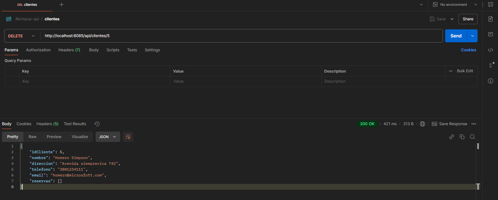

# Desarrollo del Backend API (II)

## Asegurar las rutas del API

Es importante proteger los endpoints de la api con el propósito de que no sean accesibles para cualquier usuario, principalmente, un usuario que no se haya autenticado en nuestra aplicación.

Hay varias formas de lograr esto. Nosotros utilizaremos un protocolo llamadno _Json Web Token (JWT)_, que es un método popular para proteger las aplicaciones web modernas. Los JWT permiten transmitir información de forma segura entre partes como un objeto JSON compacto, autónomo y firmado digitalmente.

JWT, por ser un protolo, se puede implementar en una amplia gama frameworks, de distintos tipos de lenguajes de programación.

Acá se puede encontrar más información sobre JWT: <https://jwt.io/>

Para la seguridad de un proyecto de spring (o spring boot) utilizaremos el proyecto/libreria Spring Security, del ecosistema Spring, y esto nos facilitará de manera sustancial, el trabajo que queremos hacer.

### Agregar la dependencia de Spring security al proyecto

#### Agregar las dependencia por medio de la Extensión de VSCode

Si instalamos la extensión _spring boot gradle plus_, vamos al buscador y escribimos los siguiente:

```gradle
> Add a dependency

```

Sale una ventana como se ve en la imagen:



En la ventana que sale, escribimos "security" y seleccionamos la dependencia spring-boot-starter-security

#### Agregar la dependencia de forma manual

También podemos agregar la información de forma manual.

En el archivo build.gradle agregamos la siguiente línea en la sección de dependencias:

```gradle
implementation 'org.springframework.boot:spring-boot-starter-security'
```

#### Agregar la dependencia de JWT

para agregar la dependencia de JWT (una dependencia externa a Spring boot), agregamos la siguiente línea a la sección de dependencias del archivo build.gradle:

```gradle
implementation 'org.springframework.boot:spring-boot-starter-security'
implementation group: 'io.jsonwebtoken', name: 'jjwt-api', version: '0.12.6'
runtimeOnly group: 'io.jsonwebtoken', name: 'jjwt-impl', version: '0.12.6'
runtimeOnly group: 'io.jsonwebtoken', name: 'jjwt-jackson', version: '0.12.6'

```

### Desarrollar la seguridad en Spring boot

En resumen, de la siguiente manera utilizaremos las tecnologías y herramientas agregadas al proyecto:

- Con Spring Security, Creamos las clases para la configuración de la aplicación para la seguridad: ApplicationConfig, SecurityConfig. En estas clases se realiza el proceso de configuración de seguridad los endpoints, cuales deben pasar por validaciónd e token (_autenticated_) y cuales deben permitirse sin autenticación (_permitAll_)
- Implementación de interfaces que ayudan al proceso de autenticación: User y UserDetails
- Implementación del filtro de seguridad: OncePerRequestFilter (esto se hace en el filtro JwtAuthFilter)
- Con JsonWebToken hacemos el servicio de creación y validación del token (JwtServicio)
- Se crea la entidad de usuario con su respectivo repositorio
- Se crea el Servicio de usuario, que tendrá el registro de usuario y el login
- El Controlador de usuario, para manejar las peticiones de las acciones anteriores.

#### Clases de configuración

Creamos las clases de configuración: ApplicationConfig, SecurityConfig

```java 
//ApplicationConfig.java
@Configuration
public class ApplicationConfig {

    @Autowired
    private DetalleUsuarioServicio detalleUsuarioServicio;

    @Bean
    public BCryptPasswordEncoder decodificador() {
        return new BCryptPasswordEncoder();
    };

    @Bean
    public AuthenticationManager authenticationManager(HttpSecurity http, BCryptPasswordEncoder bCryptPasswordEncoder)
            throws Exception {
        AuthenticationManagerBuilder auth = http.getSharedObject(AuthenticationManagerBuilder.class);
        auth.userDetailsService(detalleUsuarioServicio).passwordEncoder(bCryptPasswordEncoder);
        return auth.build();
    }
}


//SecurityConfig
@Configuration
@EnableWebSecurity
@RequiredArgsConstructor
public class SecurityConfig {

    @Autowired
    private JwtAuthFilter jwtAuthFilter;

    private static final String[] AUTH_WHITELIST = {
            "/api/auth/login",
            "/api/auth/registro"
    };

    @Bean
    public SecurityFilterChain securityFilterChain(HttpSecurity http) throws Exception {
        http
                .csrf(AbstractHttpConfigurer::disable)
                .authorizeRequests(authorizeRequests -> authorizeRequests.requestMatchers(AUTH_WHITELIST).permitAll()
                        .anyRequest().authenticated())
                .sessionManagement(
                        sessionManagement -> sessionManagement.sessionCreationPolicy(SessionCreationPolicy.STATELESS))
                .addFilterBefore(jwtAuthFilter, UsernamePasswordAuthenticationFilter.class);
        return http.build();
    }
}

```

El SecurityFilterChain es un filtro de servlet que es responsable de toda la seguridad (proteger las URL de la aplicación, validar el nombre de usuario y las contraseñas enviadas, redirigir al formulario de inicio de sesión, etc.) dentro de su aplicación.

En la clase ApplicationConfig, se tiene el AuthenticationManager, que intenta autenticar el objeto de autenticación pasado y devuelve un objeto de autenticación completamente poblado (incluidas las autoridades otorgadas) si tiene éxito.

#### Filtro y servicio Jsonwebtoken

```java

@Component
@RequiredArgsConstructor
public class JwtAuthFilter extends OncePerRequestFilter {

    @Autowired
    private JwtServicio servicioJwt;

    @Autowired
    private DetalleUsuarioServicio detalleUsuarioServicio;

    @Override
    protected void doFilterInternal(@SuppressWarnings("null") HttpServletRequest request, HttpServletResponse response,
            FilterChain filterChain)
            throws ServletException, IOException {
        if (request.getServletPath().contains("/api/auth")) {
            filterChain.doFilter(request, response);
            return;
        }

        String cabeceraAutorizacion = request.getHeader("Authorization");

        if (cabeceraAutorizacion == null || !cabeceraAutorizacion.startsWith("Bearer ")) {
            filterChain.doFilter(request, response);
            return;
        }

        String jwtToken = cabeceraAutorizacion.substring("Bearer ".length());
        String nombreUsuario = servicioJwt.extraerUsuario(jwtToken);

        if (nombreUsuario != null && SecurityContextHolder.getContext().getAuthentication() == null) {
            UserDetails detalleUsuario = detalleUsuarioServicio.loadUserByUsername(nombreUsuario);
            if (servicioJwt.validarToken(jwtToken, detalleUsuario)) {
                UsernamePasswordAuthenticationToken authenticationToken = new UsernamePasswordAuthenticationToken(
                        detalleUsuario, null, detalleUsuario.getAuthorities());
                authenticationToken.setDetails(new WebAuthenticationDetailsSource().buildDetails(request));
                SecurityContextHolder.getContext().setAuthentication(authenticationToken);
            }
        }
        filterChain.doFilter(request, response);

    }
}

```

El filtro utiliza el servicio para validar las URLs del backend 

```java

@Service
public class JwtServicio {
    private final String USUARIO_CLAIM = "usuario";
    private final String EXPIRACION_CLAIM = "exp";

    @Value("${jwt.secret}")
    private String secreto;


    public String extraerUsuario(String jwtToken) {
        final Claims claims = extraerTodosClaims(jwtToken);
        return claims.get(USUARIO_CLAIM, String.class);
    }

    private Claims extraerTodosClaims(String jwtToken) {
        return Jwts.parser().verifyWith(obtenerClaveDeFirma()).build().parseSignedClaims(jwtToken).getPayload();
    }

    private SecretKey obtenerClaveDeFirma() {
        byte[] bytes = Decoders.BASE64.decode(secreto);
        return Keys.hmacShaKeyFor(bytes);
    }

    public boolean validarToken(String jwtToken, UserDetails detalleUsuario) {
        String usuario = extraerUsuario(jwtToken);
        return usuario.equals(detalleUsuario.getUsername()) && !esTokenExpirado(jwtToken);
    }

    private boolean esTokenExpirado(String jwtToken) {
        return extraerExpiracionToken(jwtToken).before(new Date());
    }

    private Date extraerExpiracionToken(String jwtToken) {
        Claims claims = extraerTodosClaims(jwtToken);
        return claims.get(EXPIRACION_CLAIM, Date.class);
    }

    public String generarToken(Usuario usuario) {
        return crearToken(usuario);
    }

    private String crearToken(Usuario usuario) {
        return Jwts.builder().claim(USUARIO_CLAIM, usuario.getUsuario())
                .issuedAt(new Date(System.currentTimeMillis()))
                .expiration(new Date(System.currentTimeMillis() + 1000 * 60 * 60 * 10))
                .signWith(obtenerClaveDeFirma())
                .compact();
    }
}
```

El servicio JwtServicio implementa los métodos necesarios para crear y validar tokens, así como extraer de estos los reclamos (claims) de la carga útil.

Hay que tener en cuenta que se debe registrar en el archivo properties, la propiedad de la variable
secreto (jwt.secret), algo como esto:

```properties
jwt.secret=9a4f2c8d3b7b1c5f47c3a0b2m387d8b1d4e6f3c8a9d2b5f8e3a9c8b5f6v8a3d9
```

### Servicio de usuario y la implementación de UserDetails

```java
@Service
public class DetalleUsuarioServicio implements UserDetailsService {

    @Autowired
    private UsuarioRepositorio repoUsuario;

    @Override
    public UserDetails loadUserByUsername(String username) throws UsernameNotFoundException {
        return repoUsuario.findByUsuario(username)
                .map(user -> User.builder().username(user.getUsuario())
                        .password(user.getPassword()).build())
                .orElseThrow(() -> new UsernameNotFoundException("Usuario no encontrado"));
    }
}

```

```java
@Service
public class UsuarioServicioImpl implements IUsuarioServicio {

    private final BCryptPasswordEncoder codificadorPassword = new BCryptPasswordEncoder();

    @Autowired
    private JwtServicio servicioJwt;

    @Autowired
    private AuthenticationManager managerAutenticacion;

    @Autowired
    private UsuarioRepositorio repo;

    @Override
    public UsuarioDTO registro(UsuarioDTO usuarioDto) {
        Usuario usuario = new Usuario();
        usuario.setIdUsuario(usuarioDto.getIdUsuario());
        usuario.setEmail(usuarioDto.getEmail());
        usuario.setNombre(usuarioDto.getNombre());
        usuario.setPassword(codificadorPassword.encode(usuarioDto.getPassword()));
        usuario.setUsuario(usuarioDto.getUsuario());
        usuario = repo.save(usuario);
        return UsuarioDTO.builder()
                .email(usuario.getEmail())
                .idUsuario(usuario.getIdUsuario())
                .nombre(usuario.getNombre())
                .usuario(usuario.getUsuario())
                .password(usuario.getPassword())
                .build();
    }

    @Override
    public String login(LoginDTO login) {

        managerAutenticacion
                .authenticate(new UsernamePasswordAuthenticationToken(login.getUsuario(), login.getPassword()));
        Usuario usuario = repo.findByUsuario(login.getUsuario())
                .orElseThrow(() -> new EntityNotFoundException("Usuario no encontrado"));
        return servicioJwt.generarToken(usuario);
    }
}

```

La implementación de la intefaz UserDetailsService se usa para tener acceso a los detalles del usuario que se loguea: usario, contraseña, email, entre otros.

La clase _UsuarioServicio_ tiene los métodos de registro de usuario en la base de datos y el método de logín, que usa el Manejador de autenticación _AuthenticationManager_

### Entidad usuario y repositorio

```java

@Entity
@Data
public class Usuario {

    @Id
    private Integer idUsuario;
    private String usuario;
    private String password;
    private String nombre;
    private String email;

}

```

```java
public interface UsuarioRepositorio extends JpaRepository<Usuario, Integer> {
    Optional<Usuario> findByUsuario(String usuario);
}

```

En el repositorio de la entidad del Usuario, declaramos un método para optener un usuario por su nombre de usuario (es decir, el atributo usuario).

### El Controlador de usuario y los DTO requeridos

```java

@RestController
@RequestMapping("/api/auth")
@RequiredArgsConstructor
public class UsuarioControlador {

    @Autowired
    private UsuarioServicioImpl usuarioServicio;

    @PostMapping("/registro")
    public ResponseEntity<UsuarioDTO> registrarUsuario(@RequestBody UsuarioDTO entity) {
        UsuarioDTO usuarioDTO = usuarioServicio.registro(entity);
        return ResponseEntity.ok().body(usuarioDTO);
    }

    @PostMapping("/login")
    public ResponseEntity<String> login(@RequestBody LoginDTO entity) {
        return ResponseEntity.ok().body(usuarioServicio.login(entity));
    }

}
```

```java

@AllArgsConstructor
@NoArgsConstructor
@Data
@Builder
public class UsuarioDTO {
    private Integer idUsuario;
    private String usuario;
    private String password;
    private String nombre;
    private String email;
}

```

```java

@AllArgsConstructor
@NoArgsConstructor
@Data
@Builder
public class LoginDTO {

    private String usuario;
    private String password;

}

```

El controlador de usuario maneja los endpoint para el registro y el login del usuario

## Prueba de la seguridad de la api con Postman

Luego de configurada la aplicación, la ejecutamos y probamos la seguridad implementada:

Hacemos una petición a una ruta protegida: Ejemplo GET clientes

### Consulta a una URL protegida


Notamos que la respuesta es 403: Forbbiden, es decir, no tenemos permiso para acceder a ese recurso.

Entonces debemos primero, registrar un usuario, si no tenemos, y loguearlo en la aplicación para obtener el token:

### Registro de usuario


### Login de usuario para obtener el token

Como ya registramos un usuario, vamos al endpoint de login para poder obtener el token de acceso a las URLs protegidas


Ahora, utilizamos el token generado para poder acceder a las rutas protegidas: En la petición buscamos la pestaña _Autorization_ y ahí incluimos la cabecerar _Bearer authentication_, y agregamos el token y hacemos la petición.


Acá solamente es ejecutar la petición y esperar la respuesta:


