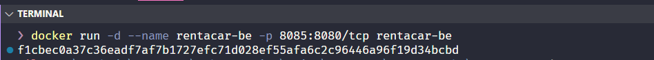
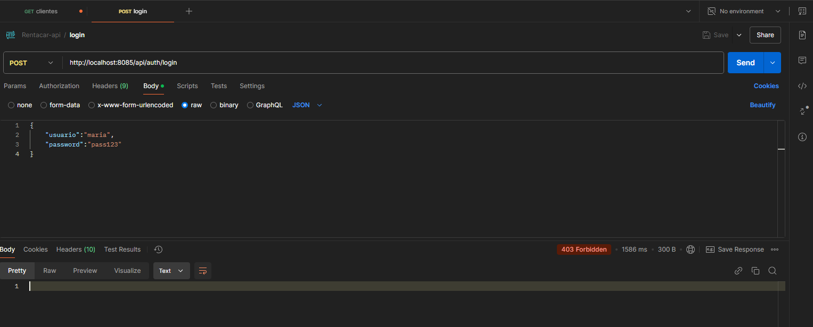
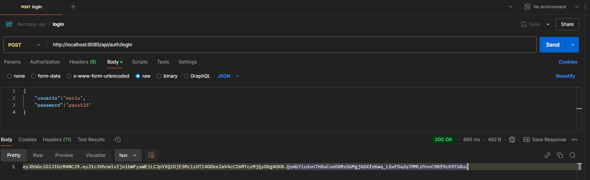
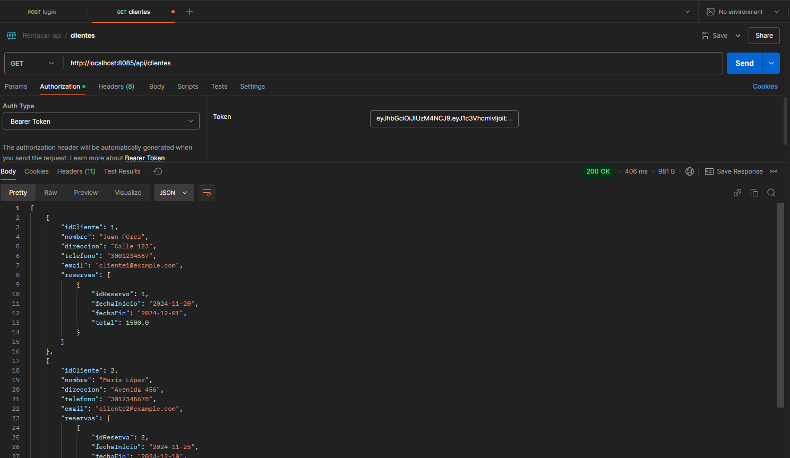

# Despliegue del backend con Docker

Una vez finalizado todo el desarrollo del backend, vamos a automatizar el despliegue de este componente con 
docker. Ya vimos algo de este proceso cuando contenerizamos la base de datos.

## Preparar el proyecto para "Empaquetar"

Lo primero que debemos hacer es generar el archivo JAR o WAR de ejecución de la aplicación. Para esto, con gradle  ejecutamos el siguiente comando:

```bat
./gradlew bootJar

```

Esto generará un archivo .jar en el directorio build/libs/ (por ejemplo, build/libs/rentacar-0.0.1-SNAPSHOT.jar).

## Crear el archivo Dockerfile

El archivo Dockerfile crea la imagen del contenedor para nuestra aplicación, el siguiente es el código de ese archivo para el proyecto:

```dockerfile

# Usa una imagen base con Java
FROM eclipse-temurin:23-jdk-alpine

# Crea un directorio para la aplicación
WORKDIR /app

# Copia el archivo JAR generado por Gradle al contenedor
COPY build/libs/rentacar-0.0.1-SNAPSHOT.jar app.jar

# Expone el puerto en el que tu aplicación se ejecutará
EXPOSE 8080

# Comando para ejecutar la aplicación
ENTRYPOINT ["java", "-jar", "app.jar"]
```

### Crear el archivo .dockerignore

El archivo .dockerignore se utiliza para excluir archivos y carpetas innecesarias al construir la imagen:

```properties
build/
.gradle/
*.git
*.idea
logs/

```

## Construir la imagen

En la raiz del proyecto, donde creamos el Dockerfile, ejecutamos el comando para construir la imagen:

```bat
docker build -t rentacar-be .
```

### Ejecutar el contenedor

Una vez creada la imagen, si no se nos presenta algún problema, podemos ejecutar el contendor con el siguiente comando:

```bat
docker run -d --name rentacar-be -p 8085:8085/tcp rentacar-be

```

Este comando no ayuda a crear y ejecutar un contenedor basado en la imagen de la aplicación.
Al ejecutar el contenedor, debe salir en la terminal el ID del contenedor, si no se presentó ningún error.



Si ejecutamos la aplicación, probamos el postman el login, nos sale el siguiente error:



Podemos revisar los errores que se presenten en las aplicaciones dentro de los contenedores. Con el siguiente comando podemos ver los logs de la aplicación ejecutándose en el contenedor:

```bat
docker logs rentacar-be
```

Podemos ver, al final del log un error similar al siguiente:

```log
The last packet sent successfully to the server was 0 milliseconds ago. The driver has not received any packets from the server.
        at java.base/jdk.internal.reflect.DirectConstructorHandleAccessor.newInstance(DirectConstructorHandleAccessor.java:62) ~[na:na]
        at java.base/java.lang.reflect.Constructor.newInstanceWithCaller(Constructor.java:501) ~[na:na]
        at java.base/java.lang.reflect.Constructor.newInstance(Constructor.java:485) ~[na:na]
        at com.mysql.cj.exceptions.ExceptionFactory.createException(ExceptionFactory.java:61) ~[mysql-connector-j-8.3.0.jar!/:8.3.0]
        at com.mysql.cj.exceptions.ExceptionFactory.createException(ExceptionFactory.java:104) ~[mysql-connector-j-8.3.0.jar!/:8.3.0]
        at com.mysql.cj.exceptions.ExceptionFactory.createException(ExceptionFactory.java:149) ~[mysql-connector-j-8.3.0.jar!/:8.3.0]
        at com.mysql.cj.exceptions.ExceptionFactory.createCommunicationsException(ExceptionFactory.java:165) ~[mysql-connector-j-8.3.0.jar!/:8.3.0]
        at com.mysql.cj.protocol.a.NativeSocketConnection.connect(NativeSocketConnection.java:88) ~[mysql-connector-j-8.3.0.jar!/:8.3.0]
        at com.mysql.cj.NativeSession.connect(NativeSession.java:120) ~[mysql-connector-j-8.3.0.jar!/:8.3.0]
        at com.mysql.cj.jdbc.ConnectionImpl.connectOneTryOnly(ConnectionImpl.java:935) ~[mysql-connector-j-8.3.0.jar!/:8.3.0]
        at com.mysql.cj.jdbc.ConnectionImpl.createNewIO(ConnectionImpl.java:805) ~[mysql-connector-j-8.3.0.jar!/:8.3.0]
        ... 139 common frames omitted
Caused by: java.net.ConnectException: Connection refused
        at java.base/sun.nio.ch.Net.pollConnect(Native Method) ~[na:na]
        at java.base/sun.nio.ch.Net.pollConnectNow(Net.java:682) ~[na:na]
        at java.base/sun.nio.ch.NioSocketImpl.timedFinishConnect(NioSocketImpl.java:542) ~[na:na]
        at java.base/sun.nio.ch.NioSocketImpl.connect(NioSocketImpl.java:592) ~[na:na]
        at java.base/java.net.SocksSocketImpl.connect(SocksSocketImpl.java:327) ~[na:na]
        at java.base/java.net.Socket.connect(Socket.java:760) ~[na:na]
        at com.mysql.cj.protocol.StandardSocketFactory.connect(StandardSocketFactory.java:153) ~[mysql-connector-j-8.3.0.jar!/:8.3.0]
        at com.mysql.cj.protocol.a.NativeSocketConnection.connect(NativeSocketConnection.java:62) ~[mysql-connector-j-8.3.0.jar!/:8.3.0]
        ... 142 common frames omitted
```

Este error se debe a que el contenedor del backend no está accediendo a la base de datos que está en su propio contenedor, no en el host. Para corregir esto debemos hacer dos cosas: primero, agregar el contenedor de docker en el script del docker compose y agregarlo a la misma red del contenedor de la base de datos, y segundo, cambiar la línea de conexión a la base de datos en el application.properties:

#### Agregar el backend al docker compose

Ajustamos el archivo _docker-compose.yml_ anterior para agregar la información del backend:

```dockerfile
services:
  mysql:
    image: mysql
    container_name: mysql
    ports:
      - 3307:3306
    networks:
     - redfullstack
    environment:
      - MYSQL_ROOT_PASSWORD=root
      - MYSQL_DATABASE=rentacardb
      - MYSQL_USER=admin
      - MYSQL_PASSWORD=admin
    volumes:
      - mysql_data:/var/lib/mysql
  phpmyadmin:
    image: phpmyadmin
    environment:
      - PMA_HOST=mysql
    depends_on:
      - mysql
    container_name: phpmyadmin
    ports:
      - 8180:80
    networks:
     - redfullstack
  rentacar_be:
    image: rentacar-be
    container_name: rentacar_be
    restart: always
    ports:
      - 8085:8085
    networks:
     - redfullstack
    depends_on:
      - mysql
networks:
  redfullstack:
    driver: bridge
volumes:
  mysql_data:
```

### Cambiar la configuración de conexión a la base de datos

Ahora, debemos cambiar la configuración conexión a la base de datos en el backend, en el archivo properties, cambiamos la
línea:

```properties
spring.datasource.url=jdbc:mysql://localhost:3307/rentacardb
```
Por esta:

```properties
spring.datasource.url=jdbc:mysql://mysql:3306/rentacardb
```

## Ejecutar todo junto

Ahora solamente es compilar nuevamente el backend y recrear la imagen con el nuevo cambio y luego ejecutar el docker compose:

```bat
./gradlew bootJar

docker build -t rentacar-be .

docker compose up -d
```

## Probando todo junto

Una vez se ejecuta el docker compose, con los contenedores arriba, procedemos a hacer pruebas:



