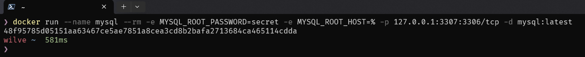
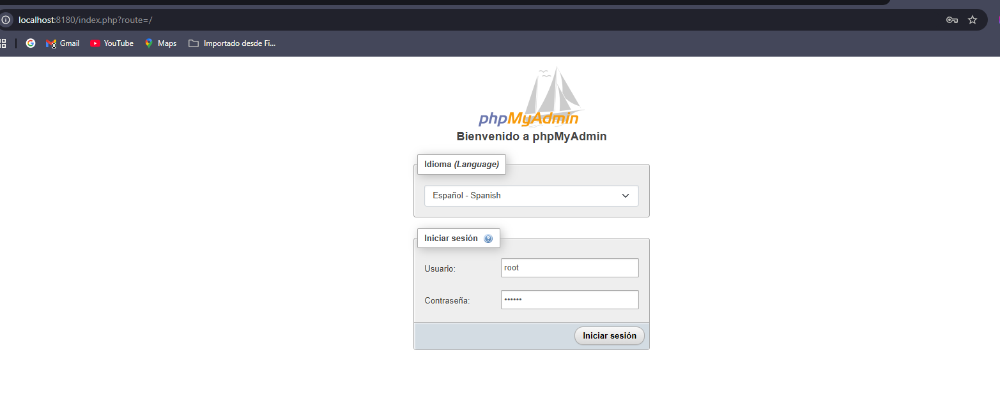
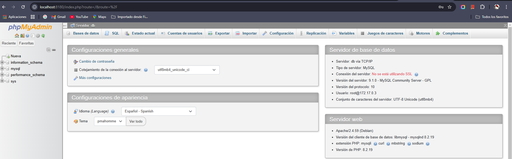
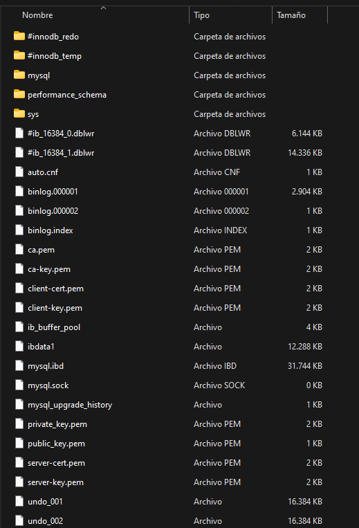
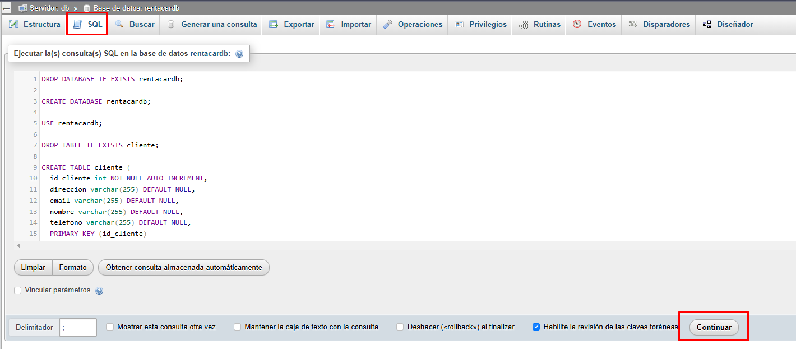

# Base de datos

La base de datos es parte fundamental de la aplicación. En esta escenario vamos a mostrar
un esquema relacional de los datos del negocio: Una renta de autos.

Clientes: Información de los clientes que rentan autos.
Autos: Información de los autos disponibles para renta.
Rentas: Información de las rentas realizadas.
Pagos: Información de los pagos realizados por las rentas.
Usuarios: una tabla usuarios para hacer el proceso de registro y acceso a la aplicación.

Relaciones:
Clientes -> Rentas: Un cliente puede tener múltiples rentas.
Autos -> Rentas: Un auto puede ser rentado múltiples veces.
Rentas -> Pagos: Cada renta puede tener uno o más pagos.

Esquema Relacional:

Clientes (1) <--> (M) Rentas
Autos (1) <--> (M) Rentas
Rentas (1) <--> (M) Pagos

## Crear el modelo de base de datos

Utilizaremos el siguiente script inicial para crear la base de datos en mysql, el nombre de la base de datos será **rentacardb**.

```sql
DROP DATABASE IF EXISTS rentacardb;

CREATE DATABASE rentacardb;

USE rentacardb;

DROP TABLE IF EXISTS cliente;

CREATE TABLE cliente (
  id_cliente int NOT NULL AUTO_INCREMENT,
  direccion varchar(255) DEFAULT NULL,
  email varchar(255) DEFAULT NULL,
  nombre varchar(255) DEFAULT NULL,
  telefono varchar(255) DEFAULT NULL,
  PRIMARY KEY (id_cliente)
);

DROP TABLE IF EXISTS vehiculo;

CREATE TABLE vehiculo (
  anio int DEFAULT NULL,
  id_vehiculo int NOT NULL AUTO_INCREMENT,
  precio double DEFAULT NULL,
  marca varchar(255) DEFAULT NULL,
  modelo varchar(255) DEFAULT NULL,
  estado enum('Disponible','En_Mantenimiento','Rentado') DEFAULT NULL,
  tipo enum('Camioneta','Compacto','Deportivo','SUV','Sedan') DEFAULT NULL,
  PRIMARY KEY (id_vehiculo)
);

DROP TABLE IF EXISTS reserva;

CREATE TABLE reserva (
  fecha_fin date DEFAULT NULL,
  fecha_inicio date DEFAULT NULL,
  id_cliente int DEFAULT NULL,
  id_empleado int DEFAULT NULL,
  id_reserva int NOT NULL,
  id_vehiculo int DEFAULT NULL,
  total double DEFAULT NULL,
  PRIMARY KEY (id_reserva),
  FOREIGN KEY (id_cliente) REFERENCES cliente (id_cliente),
  FOREIGN KEY (id_vehiculo) REFERENCES vehiculo (id_vehiculo)
);

DROP TABLE IF EXISTS pago;

CREATE TABLE pago (
  id_pago int NOT NULL AUTO_INCREMENT,
  id_reserva int DEFAULT NULL,
  metodo_pago enum('Efectivo','Debito','Credito','Transferencia') DEFAULT NULL,
  valor double DEFAULT NULL,
  fecha_pago datetime(6) DEFAULT NULL,
  PRIMARY KEY (id_pago),
  KEY id_reserva (id_reserva),
  CONSTRAINT pago_ibfk_1 FOREIGN KEY (id_reserva) REFERENCES reserva (id_reserva)
);

DROP TABLE IF EXISTS usuario;

CREATE TABLE usuario (
  idusuario int NOT NULL AUTO_INCREMENT,
  usuario varchar(45) NOT NULL,
  contrasena varchar(200) NOT NULL,
  nombre varchar(45) DEFAULT NULL,
  PRIMARY KEY (idusuario),
  UNIQUE KEY usuario_UNIQUE (usuario)
);
```

## Desplegar la base de datos: Docker

Utilizaremos docker para poder desplegar la base de datos.

Docker es un proyecto de código abierto que automatiza el despliegue de aplicaciones dentro de contenedores de software, proporcionando una capa adicional de abstracción y automatización de virtualización de aplicaciones en múltiples sistemas operativos. Docker utiliza características de aislamiento de recursos del kernel Linux, tales como cgroups y espacios de nombres (namespaces) para permitir que 'contenedores' independientes se ejecuten dentro de una sola instancia de Linux, evitando la sobrecarga de iniciar y mantener máquinas virtuales.

Acá hay un video que explica muy bien el tema de docker, y lo mejor es que es para personas que no tienen conocimiento de esta tecnología:

<https://www.youtube.com/watch?v=CV_Uf3Dq-EU>

### Instalación de docker

Antes de empezar con Docker, primero necesitamos instalarlo. A continuación hay unos enlaces que describen la instalación, dependiendo del Sistema Operativo:

- [Docker en windows](https://www.ionos.com/es-us/digitalguide/servidores/configuracion/instalar-docker-en-windows-10/)
- [Docker en Linux (Ubuntu)](https://www.digitalocean.com/community/tutorials/how-to-install-and-use-docker-on-ubuntu-20-04-es)
- [Docker en Mac](https://platzi.com/tutoriales/1204-arquitectura-docker/1779-como-instalar-docker-en-windows-y-mac/)

### Crear las instancias de mysql y el cliente para mysql

Creamos una instancia de una imagen de mysql con el siguiente comando:

```bat
docker run --name mysql -e MYSQL_ROOT_PASSWORD=secret -e MYSQL_ROOT_HOST=% -p 127.0.0.1:3307:3306/tcp -d mysql:latest
```

Si todo sale bien, en consola muestra el ID del contenedor:


Para conectarnos a la base de datos anterior, necesitamos una aplicación cliente (Ej. Mysql Workbench, consola de mysql, PhpMyAdmin, etc). PhpMyadmin es un
cliente de mysql muy popular, basado en php (utiliza un servidor apache HTTP). Podemos crear un contenedor de docker que tenga, por ejemplo, phpmyadmin:

```bat
  docker run --name phpmyadmin -d --link mysql:db -p 8180:80 phpmyadmin
```

Con esto, ya podemos acceder al servidor de phpmyadmin y luego a la base de datos:





#### Crear el contenedor de mysql persistente

Con el comando ejecutado para crear el contenedor de la base de datos, esta por defecto no almacena los datos de forma persistente. Una vez se apague o detenga
el contenedor, los datos guardados (tablas creadas, vistas, etc) serán borrados. Debemos agregar al comando algunas opciones para que se pueda guadar la
información incluso cuando se apague el contenedor. La opción principal para esto es agregar un _volumen_ al contenedor, un espacion en él para que pueda guardar
información que genera la aplicación contenida. Entonces modificamos el comando para que se ejecute lo siguiente:

```bat
-- primero se detiene el contenedor
docker stop mysql
-- ahora el comando para persistir los datos en el contenedor
docker run --name mysql -e MYSQL_ROOT_PASSWORD=secret -e MYSQL_ROOT_HOST=% -p 127.0.0.1:3307:3306/tcp -v "C:/Ejemplos/docker/mysql:/var/lib/mysql" -d mysql:latest
```

En la carpeta del Host configurada como volumen, nos ha creado algunos archivos:



### Utilizar Docker-Compose

Docker-Compose es una herramienta que permite manejar aplicaciones Docker. Con Docker-Compose se pueden definir y ejecutar aplicaciones multi-contenedores.
En lugar de ejecutar los contenedores uno por uno con la línea de comandos de Docker, se puede crear un archivo YAML para definir todos los servicios, redes y volúmenes necesarios para tu aplicación.

En este enlace puede saber más acerca de docker compose: [¿Qué es Docker Compose?](https://imaginaformacion.com/tutoriales/que-es-docker-compose)

Vamos a crear un archivo _docker-compose.yml_ para definir y ejecutar el servicio de mysql, y el cliente phpmyadmin:

```YAML
services:
  mysql:
    image: mysql
    container_name: mysql
    ports:
      - 3307:3306
    environment:
      - MYSQL_ROOT_PASSWORD=root
      - MYSQL_DATABASE=rentacardb
      - MYSQL_USER=admin
      - MYSQL_PASSWORD=admin
    volumes:
      - mysql_data:/var/lib/mysql
  phpmyadmin:
    image: phpmyadmin
    environment:
      - PMA_HOST=mysql
    depends_on:
      - mysql
    container_name: phpmyadmin
    ports:
      - 8180:80
volumes:
  mysql_data:

```

## Crear los objetos en la base de datos

Ahora con el cliente de phpmyadmin, creamos la base de datos _rentacardb_ y ejecutamos el script de creación de tablas:
En la ventana de phpmyadmin, le damos clic en la pestaña SQL y ahí pegamos y ejecutamos nuestro código y le damos clic en Continuar:



Ahora podemos proceder a crear nuestro backend.
