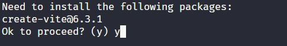
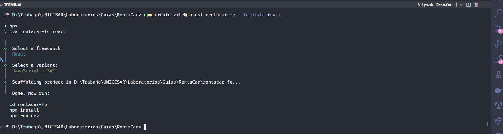
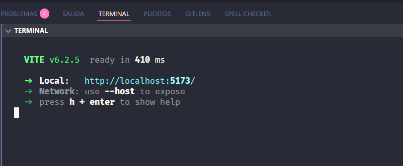
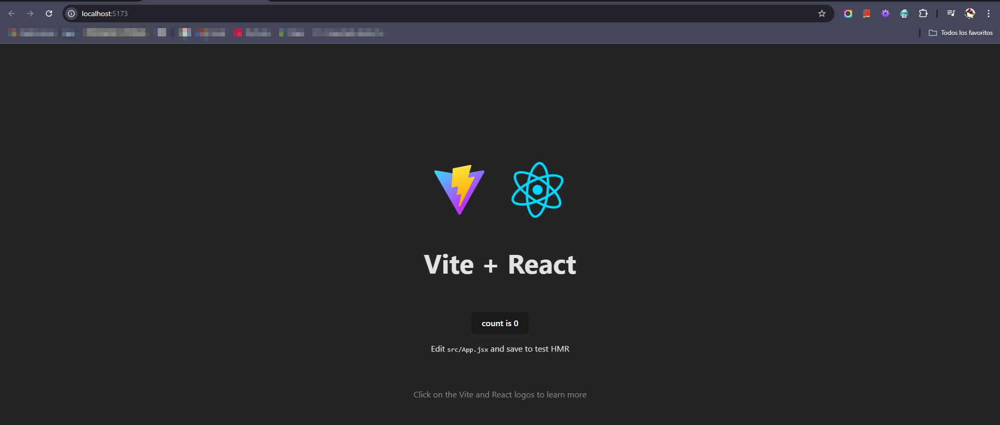

# Crear el componente de Frontend para el proyecto de RentaCar

## ¿Qué vamos a construir?

Una pequeña app frontend donde puedas:

- Ver una lista de autos disponibles
- Ver detalles de un auto
- Filtrar autos por tipo o precio

## Configurar el proyecto con Vite (más rápido que Create React App)

### Instalar Vite y crear el proyecto

Se utiliza [Vite](https://vite.dev/guide/) para gestionar el proyecto

```bash
npm create vite@latest rentacar-fe --template react
cd renta-autos
npm install
```





### Ejecuta el proyecto local

```bash
npm run dev
```



Abre el navegador y ve a [http://localhost:5173].

Debe verse algo como esto (Varía según la versión de React.)


